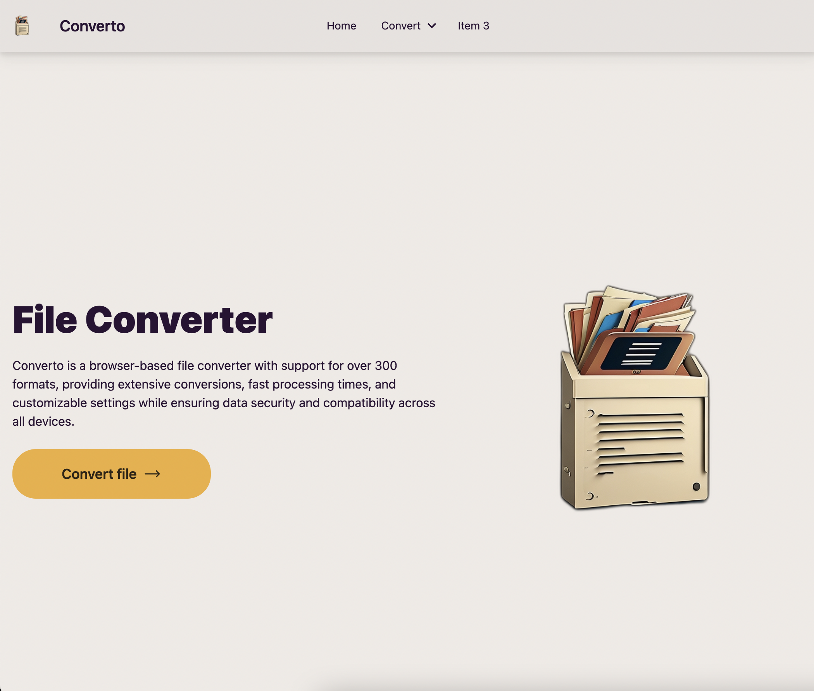
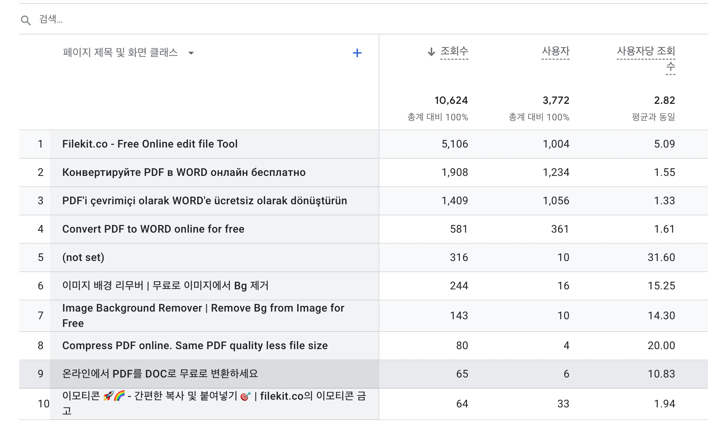
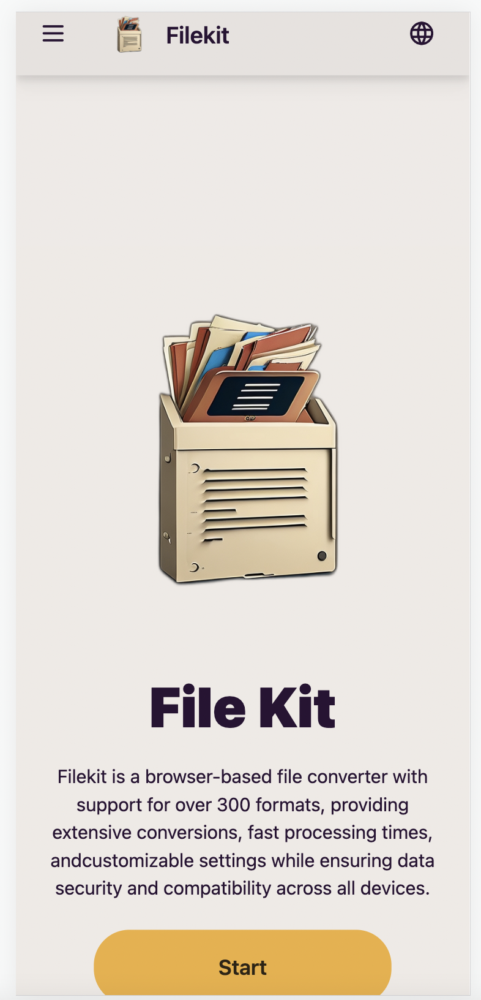
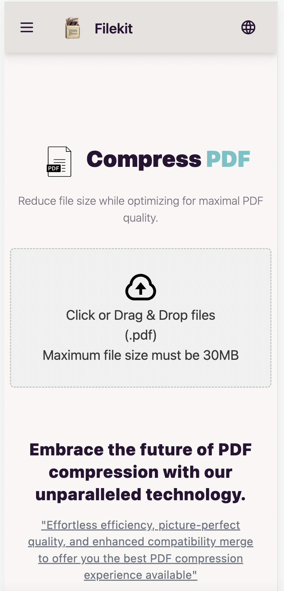
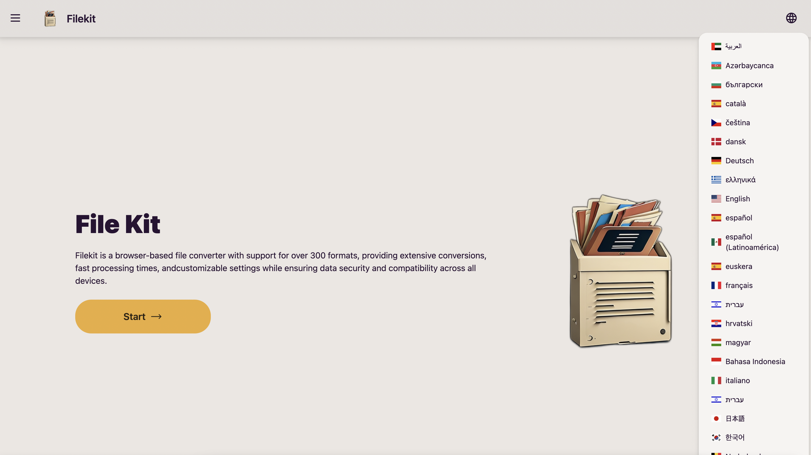
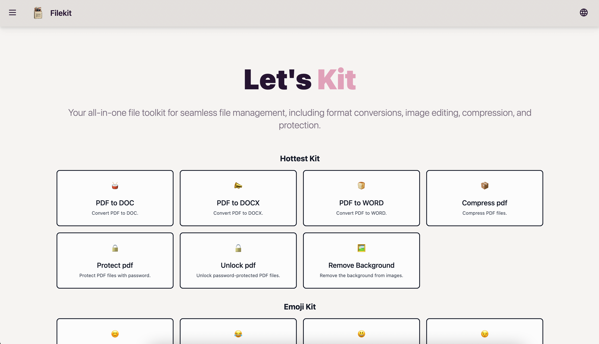
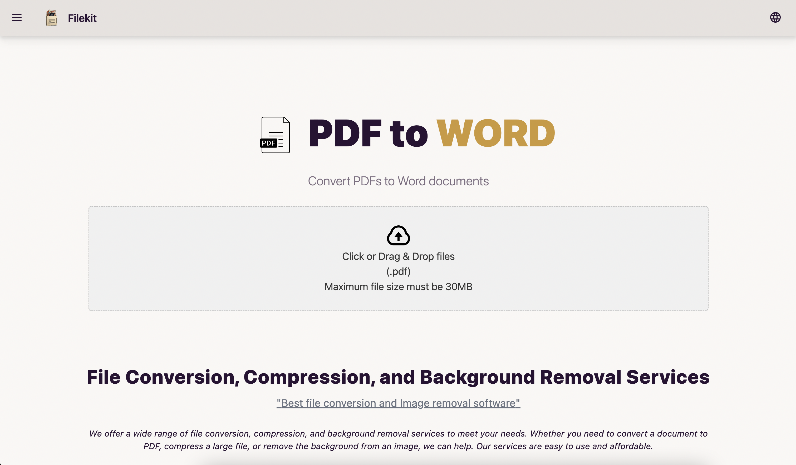
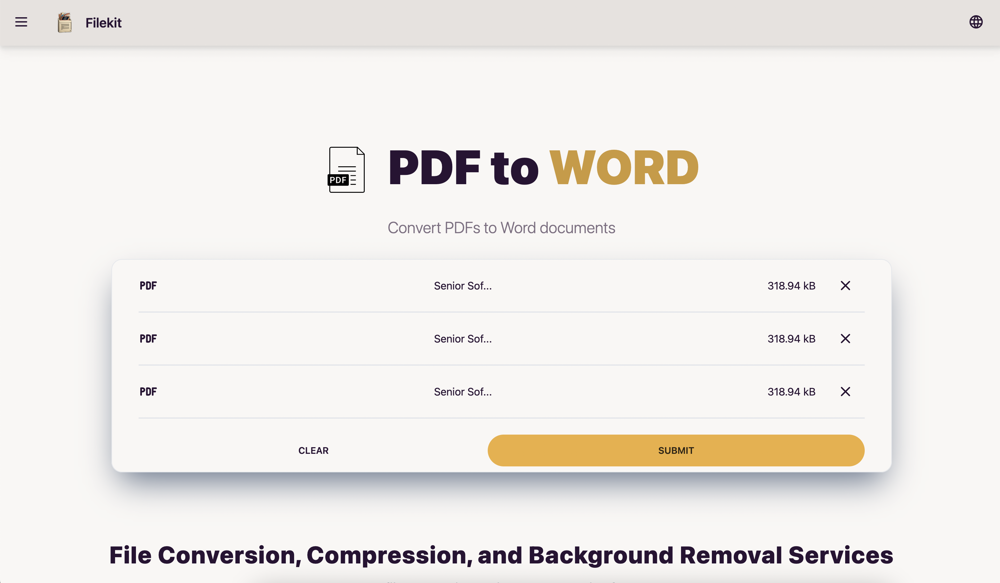
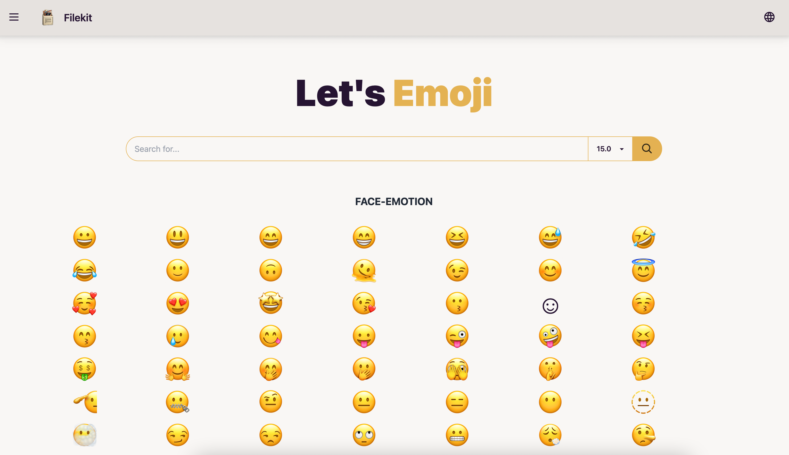
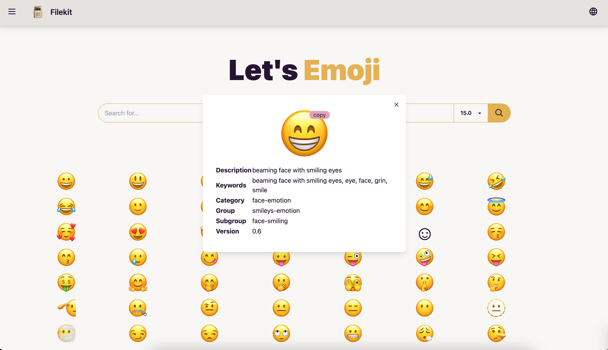

# `Filekit`
> https://filekit.co


Experience every type of file with `FileKit`.

- Web frontend:
    - [`filekit.co` frontend](https://github.com/filekit-co/converto)
    - [`youtube to mp3` frontend](https://github.com/filekit-co/youTubetoMP3)
- Api servers:
    1. [Video server (youtube to mp3/mp4)](https://github.com/filekit-co/api-video)
    2. [Image background removal server](https://github.com/filekit-co/api-bg-remove)
    3. [File handling api server](https://github.com/filekit-co/api-file/tree/main)


<center>



</center>

## Analytics
> 23.07.01 ~ 23.08.23

- Users: 3.8k
- Views: 10.6k


<center>

<table>
  <tr>
    <td></td>
    <td></td>
  </tr>
  <tr>
    <td></td>
  </tr>
</table>

</center>

## Pages

#### Mobile pages

<center>

<table>
  <tr>
    <td></td>
    <td></td>
        <td></td>
    <td></td>
  </tr>
</table>

</center>

#### Desktop pages
<center>

<table>
  <tr>
    <td></td>
    <td></td>
  </tr>
  <tr>
    <td></td>
    <td></td>
  </tr>
  <tr>
    <td></td>
    <td></td>
  </tr>
  <tr>
    <td></td>
    <td></td>
  </tr>
</table>

</center>


#### Stack

- Tailwind css
- Sveltekit
- Vercel
- DaisyUI

## Init

```bash
# alias pn=pnpm
pn create svelte@latest converto
pn i -D tailwindcss postcss autoprefixer daisyui
npx tailwindcss init -p
```

- [Docs: Install Tailwind CSS with SvelteKit](https://tailwindcss.com/docs/guides/sveltekit)
- [Docs: Install daisyUI as a Tailwind CSS plugin](https://daisyui.com/docs/install/)

## dev

```bash
pn run dev
```

## refs

- [DaisyUI website](https://github.com/saadeghi/daisyui/tree/master/src/docs)
- [SvelteKit website](https://github.com/sveltejs/kit/tree/master/sites/kit.svelte.dev)
- [RealWorld Example with SvelteKit](https://github.com/sveltejs/realworld)
- [devjaewon.com](https:github.com/devjaewon/devjaewon.com)

- file uploader
    - [filedrop-svelte](https://github.com/chanced/filedrop-svelte)
    - [tailwind component 1](https://tailwindcomponents.com/component/file-upload-with-drop-on-and-preview)
    - [tailwind component 2](https://tailwindcomponents.com/component/dragdrop-sortable-file-upload)
    
