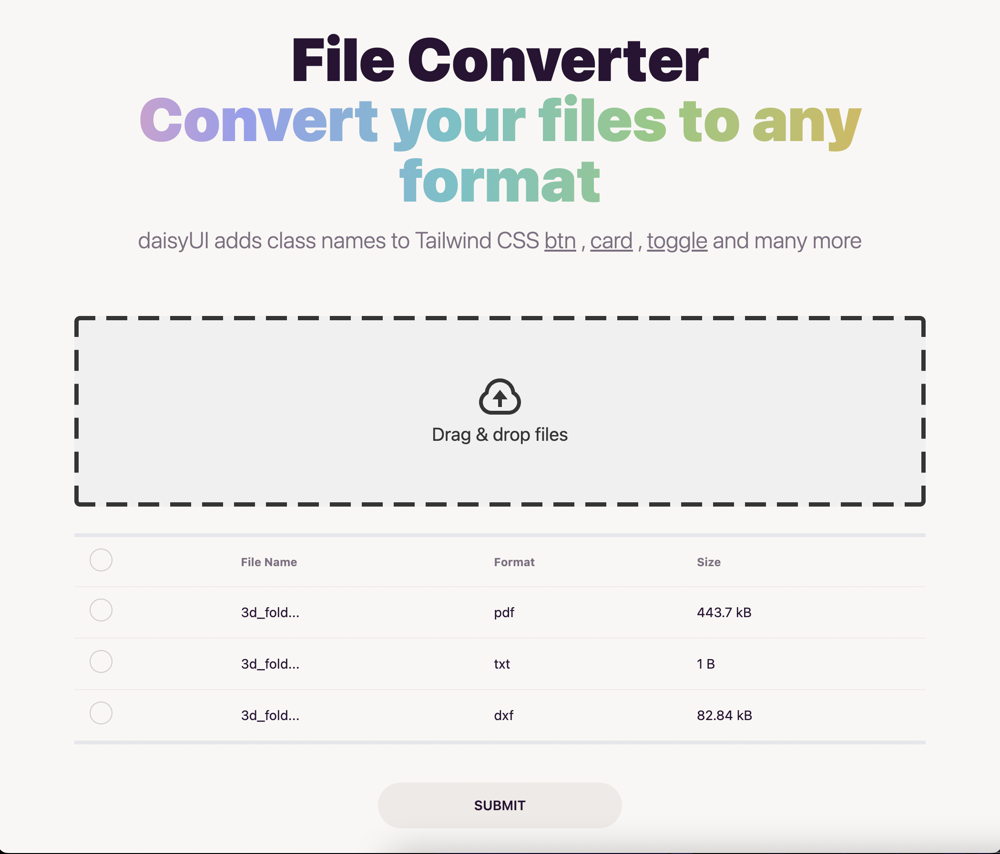

# `Converto Web`
> Convert files


|           Landing Page           |           Convert Page           |
| :------------------------------: | :------------------------------: |
|  |  |

 

#### Stack

- Tailwind css
- Sveltekit
- Vercel
- DaisyUI

## init

```bash
# alias pn=pnpm
pn create svelte@latest converto
pn i -D tailwindcss postcss autoprefixer daisyui
npx tailwindcss init -p
```

- [Docs: Install Tailwind CSS with SvelteKit](https://tailwindcss.com/docs/guides/sveltekit)
- [Docs: Install daisyUI as a Tailwind CSS plugin](https://daisyui.com/docs/install/)

## dev

```bash
pn run dev
```

## refs

- [DaisyUI website](https://github.com/saadeghi/daisyui/tree/master/src/docs)
- [SvelteKit website](https://github.com/sveltejs/kit/tree/master/sites/kit.svelte.dev)
- [RealWorld Example with SvelteKit](https://github.com/sveltejs/realworld)
- [devjaewon.com](https:github.com/devjaewon/devjaewon.com)

- file uploader
    - [filedrop-svelte](https://github.com/chanced/filedrop-svelte)
    - [tailwind component 1](https://tailwindcomponents.com/component/file-upload-with-drop-on-and-preview)
    - [tailwind component 2](https://tailwindcomponents.com/component/dragdrop-sortable-file-upload)
    

## i18n

[svelte-i18n](https://github.com/kaisermann/svelte-i18n/blob/main/docs/Svelte-Kit.md)


## structure

> Q. sveltekit로 프로젝트를 관리할때, 폴더 디렉토리를 관리하는 전략을 알려줄래?  백엔드를 예를 들면  hexagonal architecture과 같은 방식으로 /domain /infrastructure /application 같은 디렉토리를 관리하는데 svelteKit도 이와 같이 관리하는 전략이 필요해.

```
.
├── app.css
├── app.d.ts
├── app.html
├── hooks.server.ts
├── lib
│   ├── components
│   │   ├── common
│   │   └── home
│   ├── server
│   └── utils
│       └── flags
└── routes
    ├── +layout.svelte
    └── +page.svelte
```


SvelteKit는 프론트엔드 프레임워크로서 폴더 디렉토리 구조를 관리하는 데 있어서 엄격한 규칙이나 표준이 없습니다. 그러나 일반적으로 사용되는 몇 가지 구성 방법을 제안할 수 있습니다. 이러한 방법은 프로젝트의 크기와 복잡성에 따라 다를 수 있습니다.

`컴포넌트 기반 구조:`

src/components 디렉토리에 모든 Svelte 컴포넌트를 저장합니다.
컴포넌트들은 관련된 기능이나 화면 구성 요소에 따라 하위 디렉토리로 그룹화될 수 있습니다.
예를 들어, src/components/Header.svelte, src/components/Footer.svelte 등이 있을 수 있습니다.

`페이지 기반 구조:`

src/routes 디렉토리에 Svelte 페이지를 저장합니다.
각 페이지는 해당 경로와 관련된 디렉토리에 저장됩니다.
예를 들어, /about 경로의 페이지는 src/routes/about/index.svelte에 저장됩니다.
서비스 또는 기능 기반 구조:

src/services 또는 src/features와 같은 디렉토리를 생성하여 서비스 또는 기능을 구성합니다.
각 서비스 또는 기능은 자체적인 하위 디렉토리를 가질 수 있습니다.
예를 들어, src/services/auth 디렉토리에 인증 관련 컴포넌트, 페이지 및 로직을 저장할 수 있습니다.

`상태 관리 구조:`

상태 관리를 위해 Svelte의 내장 상태 관리 기능이 아닌 외부 상태 관리 라이브러리인 Redux, MobX 등을 사용한다면, 관련 파일을 별도의 디렉토리에 저장합니다.
예를 들어, src/store 디렉토리에 관련 파일들을 저장할 수 있습니다.
위의 전략들은 일반적으로 사용되는 방법 중 일부입니다. 프로젝트의 복잡성과 확장 가능성을 고려하여 이러한 방법을 조합하거나 수정할 수 있습니다. 또한, 팀 내의 일관성을 유지하기 위해 프로젝트에 적합한 디렉토리 구조를 정의하고 팀원들과 협의하는 것이 중요합니다.
